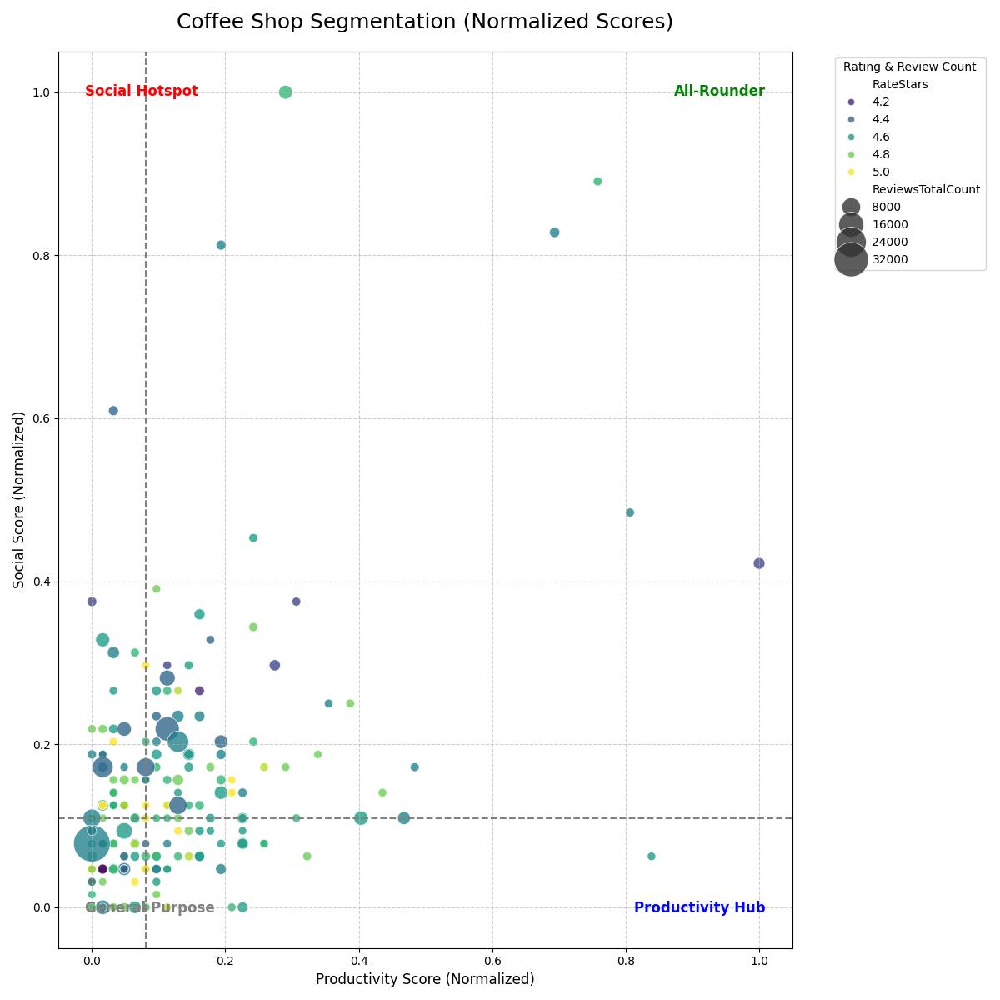

# Yogyakarta Coffee Shop Analysis: Finding the Best Spots for "Work vs. Hangout"

## 📝 Project Overview

*"Where should I work on my assignment tonight? I need a place with fast Wi-Fi and plenty of power outlets."*
*"Where's a good spot to meet up with friends tomorrow? Looking for a place with a cool vibe that's Instagrammable."*

As Indonesia's "Student City," Yogyakarta is filled with hundreds of coffee shops, each competing to offer a unique experience. However, this abundance of choice often leads to confusion, especially since the needs for **studying/working** and **socializing** demand completely different criteria from a venue.

This project was born from that dilemma and aims to dissect the Yogyakarta coffee shop landscape through the lens of data. By analyzing location data, ratings, and thousands of user reviews from Google Maps, this project seeks to answer the fundamental question: **How can we find the perfect spot among hundreds of options?**

## 📂 Data Source

This analysis utilizes two datasets sourced from Google Maps via [Kaggle](https://www.kaggle.com/datasets/adriantowijaya/coffee-shop-yogyakarta):
1.  **`coffee-shop-yogyakarta-indonesia.csv`**: Contains detailed information about coffee shops (location, hours, ratings, etc.).
2.  **`coffee-shop-review-yogyakarta-indonesia.csv`**: Contains thousands of original text reviews from visitors.

## 🚀 Analysis Workflow

The project is divided into four main analytical phases, from initial data exploration to generating final recommendations.

### Phase 1: Exploratory Data Analysis (EDA)
The initial phase focuses on understanding the overall landscape of coffee shops in Yogyakarta. This involves data cleaning and creating key visualizations to answer:
* What is the geographical distribution and concentration of coffee shops?
* What is the general quality distribution (based on star ratings)?

 

  
   
  <em>Coffee Shop Concentration Map in Yogyakarta</em>

 

 

  
   
  <em>Coffee Shop Geographical Distribution in Yogyakarta</em>

 

 

  
   
  <em>Coffee Shop Rating Distribution in Yogyakarta</em>

 

### Phase 2: Persona Analysis with NLP
This phase uses Natural Language Processing (NLP) to validate the two primary personas ("Productivity Hub" and "Social Hotspot") from review data. The process includes:
* **Advanced Text Preprocessing**: Utilizing the **Sastrawi** library for stemming and **NLTK** for stopword removal in Bahasa Indonesia.
* **Word Clouds**: Generating visualizations to identify the most frequent keywords associated with each persona.

 

  
   
  <em>Wordcloud for Social Hotspot(Nongkrong) Persona</em>

 

 

  
   
  <em>Wordcloud for Productivity Hub(Nugas) Persona</em>

 

### Phase 3: Quantitative Scoring & Segmentation
This is the core of the analysis. Each coffee shop is assigned quantitative scores based on its reviews using a sophisticated model:
* **Keyword Weighting**: Assigning higher weights to strong indicator keywords (e.g., `wifi`, `outlet` for productivity).
* **Score Normalization**: Scaling both scores to a 0-1 range for a fair and balanced comparison.
* **4-Quadrant Segmentation**: Plotting all coffee shops into four segments based on their productivity and social scores.

 

  
   
  <em>Coffee Shop Segmentation Based on Productivity vs. Social Scores</em>

 

### Phase 4: Data-Driven Recommendations
The final phase translates all analytical results into actionable recommendations. The script identifies the **Top 3 coffee shops** in each key segment based on their ratings and review counts.

## 💡 Key Findings & Recommendations

Based on the analysis, here are the top coffee shop recommendations for each persona:

✅ **For Productivity & Study (Productivity Hubs)**
The following coffee shops scored highest for a productive environment:
* 🏆 **#1:** [Nuju Coffee Sagan Yogyakarta | Coffee Shop Yogyakarta](https://maps.app.goo.gl/1VCurQt3WsdmZ8pj9)
* 🏆 **#2:** [Kopi Kalitan Jogja](https://maps.app.goo.gl/ZSz8N7Uw68jJr32x8)
* 🏆 **#3:** [Negra Coffee](https://maps.app.goo.gl/DSf7NxLaKBJw8GFs9)

🤳 **For Socializing & Gatherings (Social Hotspots)**
The following coffee shops are best suited for social activities:
* 🏆 **#1:** [Locan Coffee](https://maps.app.goo.gl/6pqfcdKzGzvcnWft5)
* 🏆 **#2:** [Warmindo Pangeran](https://maps.app.goo.gl/YgVqBrPghuyB5sgW6)
* 🏆 **#3:** [KOPI JOSS MBAK SISKA Slasar Malioboro](https://maps.app.goo.gl/5AEV9JVASrCrAA1E6)

🌟 **For the Best of Both Worlds (All-Rounders)**
These coffee shops are great for both productivity and socializing:
* 🏆 **#1:** [SANSKARA KOPI](https://maps.app.goo.gl/gcU7rPdogovWPBsv5)
* 🏆 **#2:** [Kopi Johar, Kedai Kopi Yogyakarta](https://maps.app.goo.gl/pmMYQap6ykwxHb4A6)
* 🏆 **#3:** [Entry Coffee Loewak](https://maps.app.goo.gl/BevW2KuaYGS5NK6N6)

## 🛠️ Tech Stack

* **Programming Language**: Python
* **Data Analysis**: Pandas, NumPy
* **Data Visualization**: Matplotlib, Seaborn
* **NLP**: NLTK, Sastrawi, WordCloud
* **Machine Learning**: Scikit-learn (for `MinMaxScaler`)
